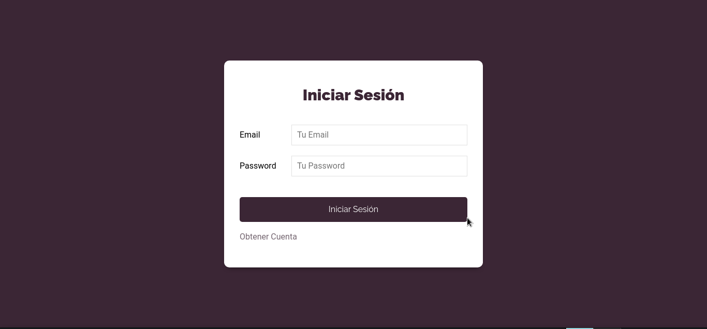
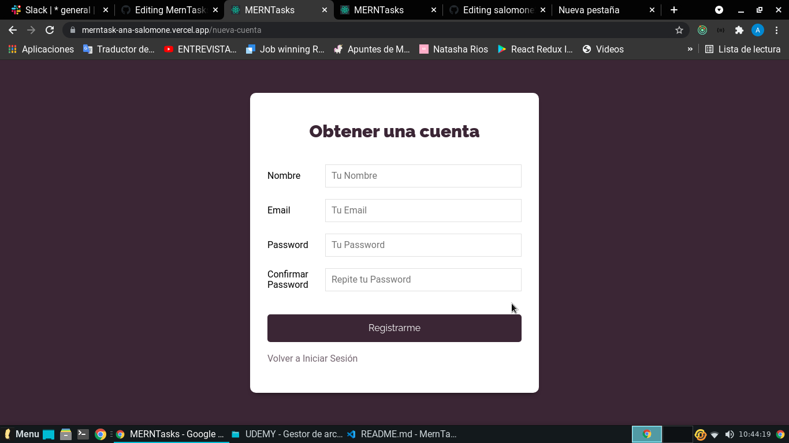
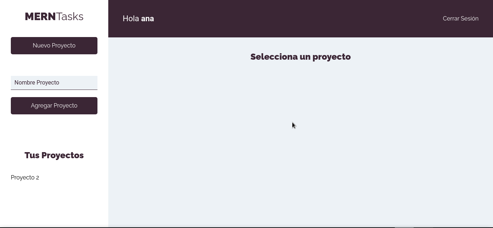
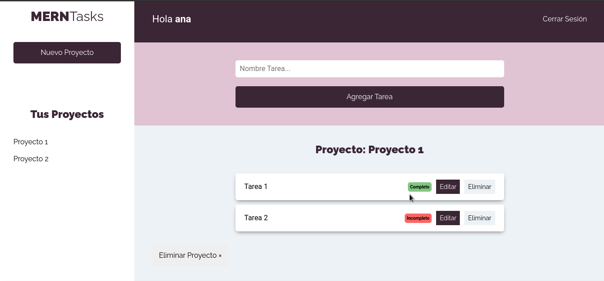

# MernTasks

 
MernTasks es una App donde podes crear una cuenta y logearte, crear proyectos y agregrarles tareas. Cada tarea puede ser editada, marcada como completa/incompleta o eliminada. Ademas se pueden eliminar los proyectos.

Podes probar la app en el siguiente link: **https://merntask-ana-salomone.vercel.app**

O a continuacion se puede ver una muestra de todas las rutas: 
### Log In:
  

### Crear Cuenta:
   

### Proyectos: 

  

  

 

------------------------------------------------------------------------------------------------------------
------------------------------------------------------------------------------------------------------------

 
MernTasks is an App where you can create an account and log in, create the proyects you wish and add some tasks. Each task can be edited, set as completed or incompleted or delete them. Also you can delete the projects

You can try the app on this link: **https://merntask-ana-salomone.vercel.app**

Or take a look on the project with the next images: 
### Log In:
  

### Create Account:
   

### Proyects: 

  

  